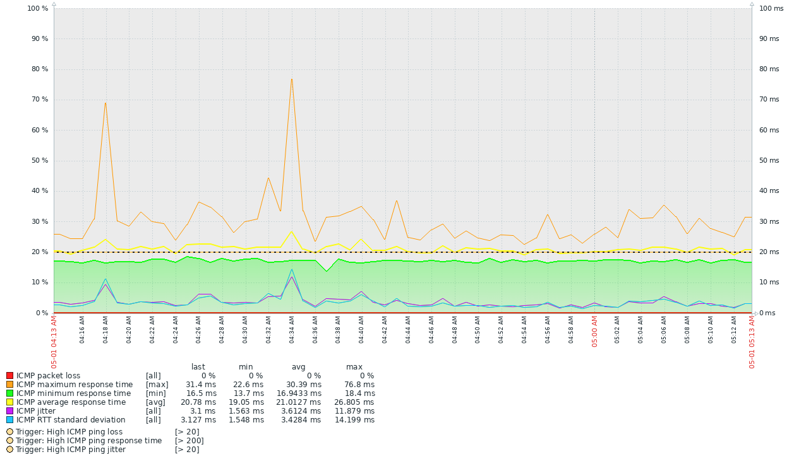

# Advanced ICMP Ping with Jitter — Português (Brasil)

Template para monitoramento avançado de ICMP no Zabbix, incluindo latência, perda de pacotes, jitter e desvio padrão de RTT usando `fping` e um coletor externo em Python.

## Compatibilidade

| Zabbix | Arquivo | Status |
| --- | --- | --- |
| 7.0 | `templates/zabbix-7.0/advanced-icmp-ping-with-jitter.yaml` | Suportado |
| 8.0 | `templates/zabbix-8.0/advanced-icmp-ping-with-jitter.yaml` | Testado no **Zabbix 8.0 Beta 2**; será revalidado em novas Beta, RC e versão final |

O coletor é compartilhado pelas versões suportadas:

```text
scripts/advanced_icmp_ping.py
```

## Como funciona

O template possui um item mestre do tipo `External check`:

```text
advanced_icmp_ping.py["{HOST.CONN}","{$ADV_FPING_POOL_COUNT}","{$ADV_FPING_INTERVAL_MS}","{$ADV_FPING_TIMEOUT_MS}"]
```

O coletor executa um único lote de `fping -C`, interpreta cada amostra de RTT e retorna JSON. Os demais itens são dependentes e usam JSONPath, o que mantém latência, perda, jitter e desvio padrão calculados sobre o mesmo conjunto de pacotes.

## Documentação

- [Instalação](installation.md)
- [Configuração e macros](configuration.md)
- [Métricas e dashboard](metrics.md)
- [Triggers](triggers.md)
- [Ajustes e tuning](tuning.md)
- [Troubleshooting](troubleshooting.md)
- [Compatibilidade com Zabbix 8.0](zabbix-8.0.md)
- [Versionamento](versioning.md)

## Estrutura do projeto

```text
.github/                 CI, segurança, Dependabot e templates do GitHub
docs/
├── images/              Imagens da documentação
└── pt-BR/               Documentação em Português do Brasil
scripts/                 Coletor externo usado em produção
templates/
├── zabbix-7.0/          Export Zabbix 7.0
└── zabbix-8.0/          Export Zabbix 8.0
tests/                   Testes unitários e fixtures de fping
tools/                   Validação semântica dos templates
```

## Métricas coletadas

- RTT médio, mínimo e máximo;
- perda de pacotes;
- pacotes enviados e recebidos;
- jitter entre respostas consecutivas;
- desvio padrão populacional do RTT;
- erro do coletor;
- JSON bruto para diagnóstico.

## Exemplo de gráfico



## Desenvolvimento e validação

Os checks locais são:

```sh
python -m pip install -r requirements-dev.txt
python -m compileall -q scripts tools tests
ruff check scripts tools tests
ruff format --check scripts tools tests
pytest -q
python tools/validate_templates.py
```

O validador confere a versão declarada pelo YAML e a paridade semântica entre os exports mantidos, sem exigir serialização idêntica entre versões do Zabbix.

Consulte também [CONTRIBUTING.md](../../CONTRIBUTING.md), [SECURITY.md](../../SECURITY.md), [CHANGELOG.md](../../CHANGELOG.md) e [NOTICE.md](../../NOTICE.md).
